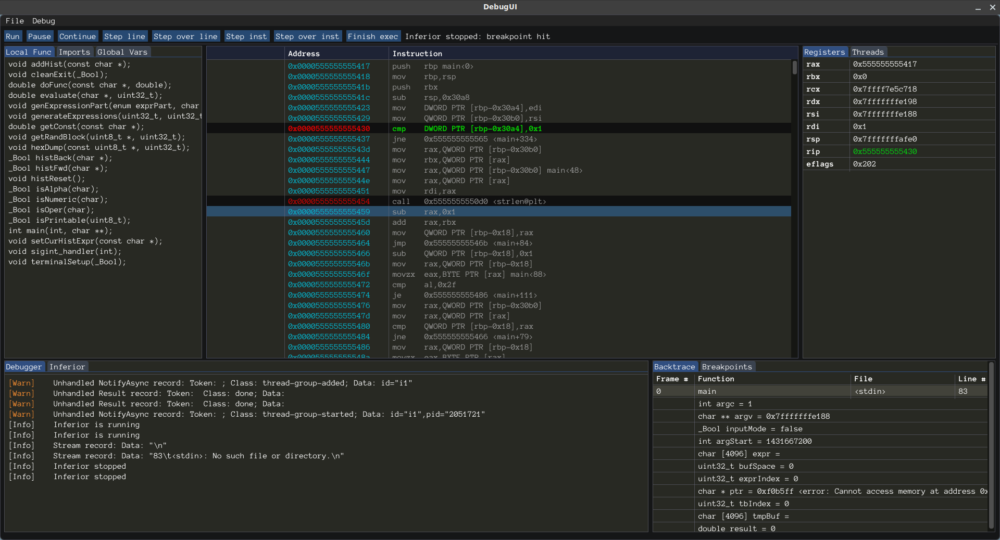

# GDBuddy

GDBuddy is a GUI frontend for GDB with the aim of providing an intuitive interface to the more advanced features of GDB as well as augmenting GDB with features more suited to a graphical environment. 

GDBuddy is still in the very early stages of development and is currently not to the point of being useable just yet. It will currently load an inferior and step through either source lines or instructions as well as set and clear
breakpoints. It currently cannot modify the inferior state in any way.

GDBuddy aims to provide an intuitive interface to the advanced features offered by GDB, such as:

- Debugging multiple inferiors
- Reverse execution
- Process checkpoints
- Process execution recording
- Watchpoints, catchpoints, and tracepoints
- Thread scheduler control, such as
	- All-stop mode
		>In all-stop mode, whenever your program stops under GDB for any reason, all threads of execution stop, not just the current thread.
	- Non-stop mode
		> GDB supports an optional mode of operation in which you can examine stopped program threads in the debugger while other threads continue to execute freely.
	- Scheduler-locking modes: on, off, step, and replay
- Conditional breakpoints
- Breakpoint command lists
- Command hooks
- GDB [Compile and Inject](https://sourceware.org/gdb/onlinedocs/gdb/Compiling-and-Injecting-Code.html#Compiling-and-Injecting-Code) functionality

Additionally, GDBuddy will augment GDB with extended functionality. Some things I am currently considering:

- An "execution trace" mode that essentially sets a breakpoint on every instruction in the program. As the program executes,
	the value of the program counter is recorded. When the program exits, the execution trace is complete.
	An execution log would then be available to show the execution path of the program. This would be very useful in debugging
	segfaults where a backtrace is unavailable because the stack got over-written.
- As an extension to the execution trace mode above, register and local variable info could be recorded as well.
	This would permit for a basic execution replay. Note that this is similar to the "record" capability offered by GDB,
	however this method would be available in the absense of the "record" capability of GDB. This may also offer some
	other advantages over the built-in record function of GDB. This should be investigated.
- Basic analysis capabilities:
	- Check whether registers contain a pointer to a string or known variable
	- Same, but for values in the stack dump
	- Annotate the dissassembly view with information from register & stack analysis
- Others, when I think of them :)

## Building and Running GDBuddy

Like mentioned above, GDBuddy is still in early development and is not ready for even the most basic debugging tasks. That being said,
if you still wish to run GDBuddy, the build process should be fairly painless.

After cloning this repo, just run `make all`. GDBuddy requires libSDL2, libGL, libGLEW and pthreads. 

GDBuddy communicates with GDB via the GDB/MI interface. It was developed against GDB version 10.0 and uses GDB/MI commands that were introduced in
recent versions of GDB. For this reason, I highly recommend [downloading the latest GDB](https://www.gnu.org/software/gdb/current/) and building GDB from source. It's surprisingly easy to compile:

- Clone the repo: `git clone git://sourceware.org/git/binutils-gdb.git`
- Enter the repo directory: `cd binutils-gdb/`
- Create a build folder: `mkdir build`
- Enter the build folder: `cd build/`
- Configure the build: `$(pwd)/../configure --prefix=/gdb/install/path/`
	> **Fix any errors reported in the configure step!**
- Build GDB: `make -jX all` where '-jX' is replaced with the number of files to build in parallel (ex. -j8)
- Lastly, install the binaries: `make install` or `sudo make install` depending on your install target.
	> **This will overwrite the GDB installed on your system if you did not pass a --prefix to configure!**
	
You'll need to update the code specifying the path to the GDB binary.
